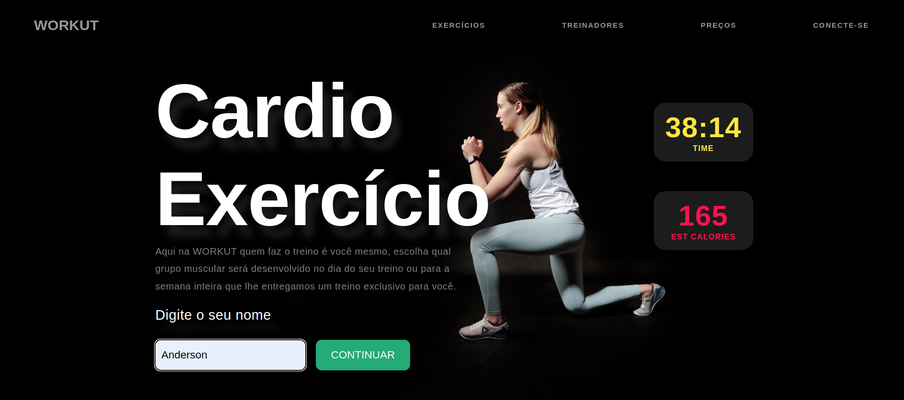
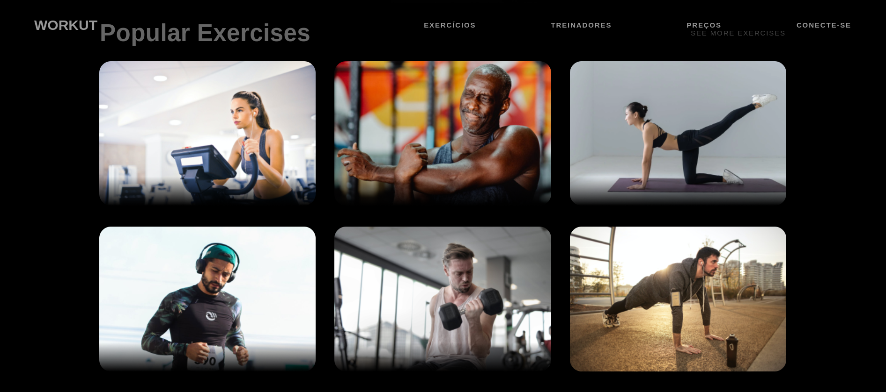
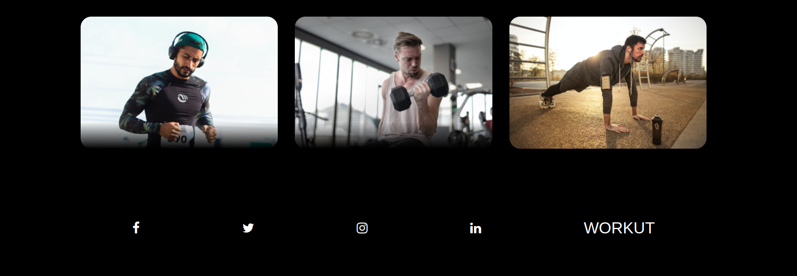
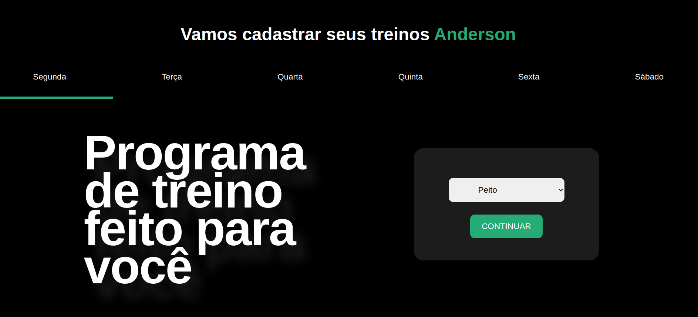
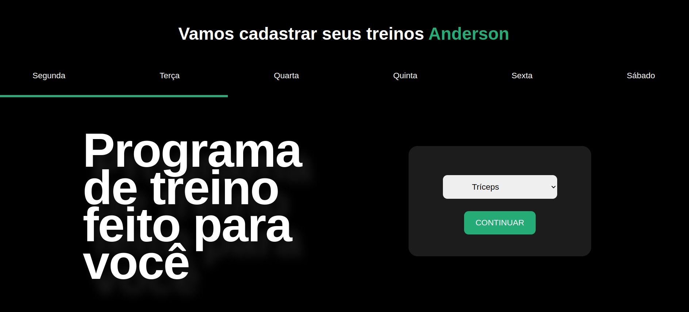
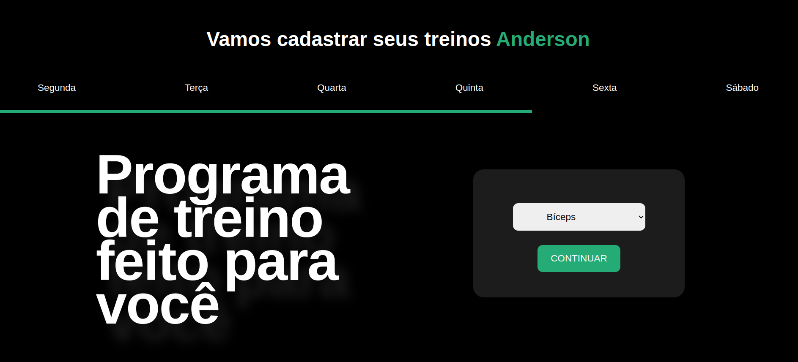
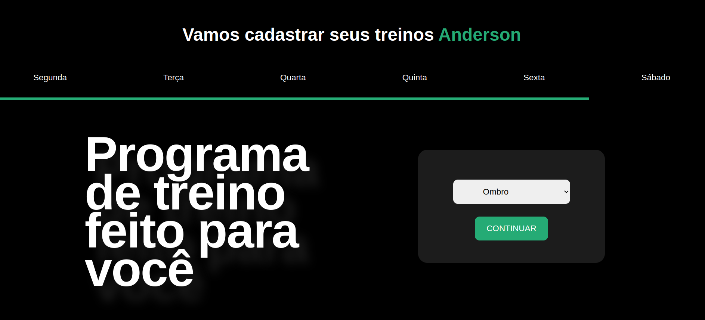
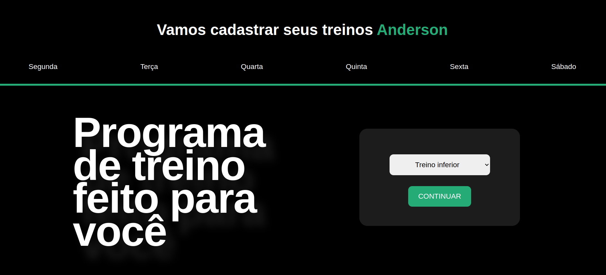
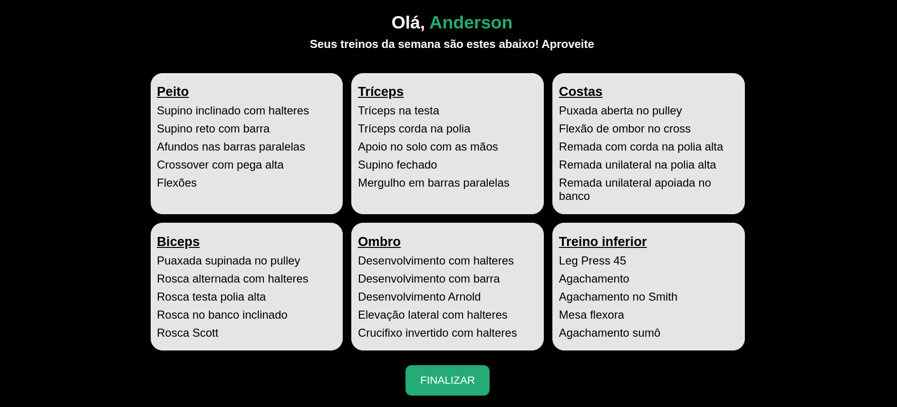

# Resumo do Projeto

O projeto em questão é uma iniciativa de autoria própria, desenvolvido com o objetivo de aprimorar meus conhecimentos e habilidades em programação, especificamente nas tecnologias HTML, CSS e JavaScript.

Trata-se de um projeto de estudo, criado para explorar os conceitos e práticas fundamentais dessas três linguagens de programação web. Ao longo do desenvolvimento, concentrei-me em criar uma aplicação web simples, porém funcional e interativa.

A estrutura principal do projeto é baseada em HTML, que é a linguagem de marcação utilizada para construir a estrutura e o conteúdo da página. Utilizei CSS para estilizar e dar uma aparência visual atrativa à aplicação. Além disso, utilizei JavaScript para adicionar funcionalidades dinâmicas e interativas ao projeto.

# Definição de produto

Projeto simulando uma página de academia, aonde você coloca o seu nome e escolhe o grupo muscular que quer treinar ao longa da sua semana, você pode visualizar o progresso da semana com a barra de progresso, ao fim dessa etapa o aluno recebe em tela os exercícios assim propostos pelo programa.

# Executando o projeto

Para rodar esse projeto é necessário ter instalado o Node.js e o npm em sua máquina

## Instale ou atualize as dependencias do projeto

```bash
npm i
```

## Rodando o projeto

```bash
npm run dev
```

## Build do projeto

```bash
npm run build
```

## deploy

link surge: skinny-underwear.surge.sh

## Desktop











